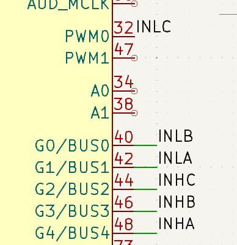
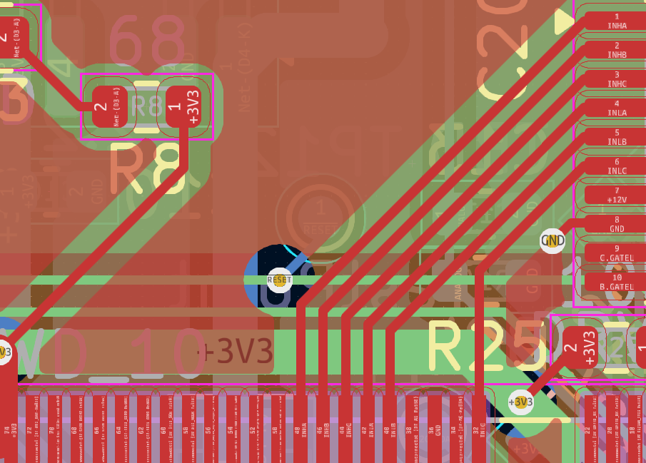
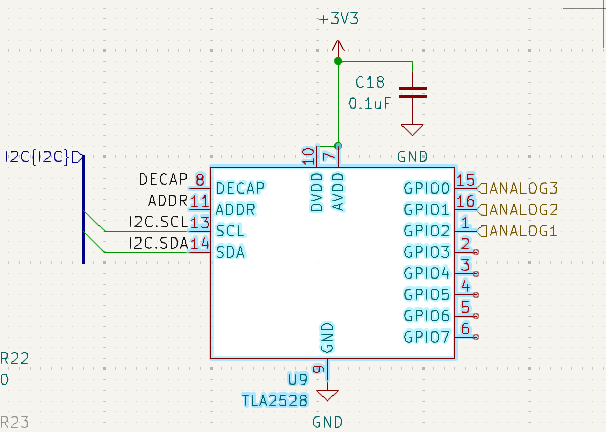

# E-Stop

## Features

- Discrete Mosfets for high power applications
- Current sensing via TLA analogue input
- Buck converter for power from high voltage sources

## Authors

- Shin Umeda

## Active Revisions

- Revision 0 (Pre-production)

## Summary

The BLDC driver board is intended to serve as a motor driver using the Micromod
platform. Utilizing a micromod, it allows for direct control using a three-phase
H-bridge driver via GPIO.

## Design Notes

In the long term, this might serve to replace the expensive pancake servo motors
we have with an in house solution. In the short term, this will control the medium
sized motors on the arm.

Notably, the pin assignments for the gates are very irregular.

This is to make routing the pins significantly easier. When suggesting new pins,
be mindful of routing difficulty. Utilize the
[micromod pin reference](https://www.sparkfun.com/micromod) when suggesting
different pins. The pins near the gate driver chip are the even pins 32 - 72.

The board is built around the
[DRV8300](https://www.ti.com/lit/ds/symlink/drv8300.pdf?HQS=dis-dk-null-digikeymode-dsf-pf-null-wwe&ts=1731785150070)
gate driver chip. Knowledge of it should not be necessary as it is merely a gate
driver. There is a TLA2528 on I2C channel of the micromod connected to each of
the phases via a current sensing amplifier. Originally it was intended that the
micromod would use the built-in ADC, but since the micromod does not guarantee 3
analogue inputs, the TLA2528 was used instead.

Notably, this board is still not done and is lacking additional I/O for peripherals
such as encoders. Give feedback to the designer on what pins should be exposed.

## Additional Resources

- [DRV8300 Datasheet](https://www.ti.com/lit/ds/symlink/drv8300.pdf)
- [TLA2528 Datasheet](https://www.ti.com/lit/ds/symlink/tla2528.pdf)

### PCB Images

### Schematic

[Schematic](outputs/bldc/sch.pdf)
