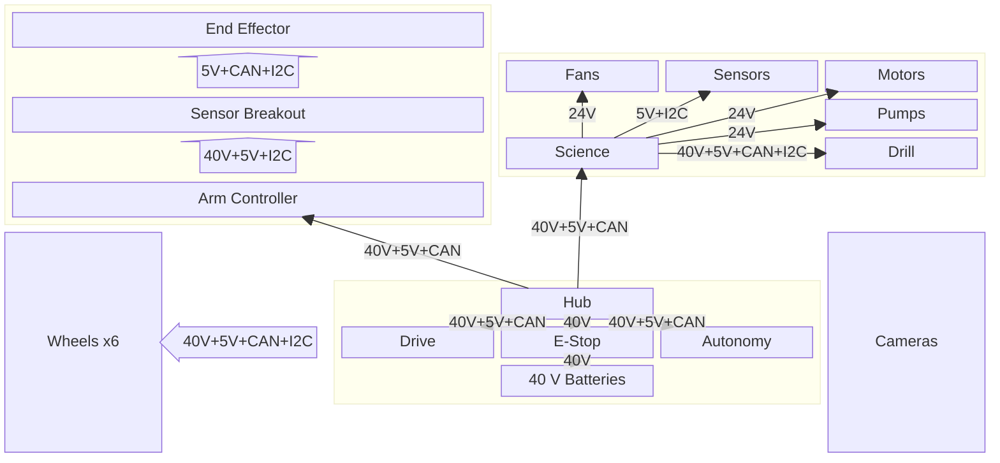

# URC Electrical 2026

This is the repo hosting both the design files and documentation for the electrical subteam.

```mermaid
block-beta
columns 6
  block:arm:3
    columns 1
    hand["End Effector"] 
    armarr1<["5V+CAN+I2C"]>(up)
    midarm["Sensor Breakout"]
    armarr2<["40V+5V+I2C"]>(up)
    armboard["Arm Controller"]
  end

  
  block:sci:3
    columns 3
    Fans Sensors Motors
    space:2 Pumps
    sciboard["Science"]  space Drill
    sciboard --"24V"--> Fans
    sciboard --"5V+I2C"--> Sensors
    sciboard --"24V"--> Motors
    sciboard --"24V"--> Pumps
    sciboard --"40V+5V+CAN+I2C"--> Drill
  end
  wheel["Wheels x6"]
  wheelbus<["40V+5V+CAN+I2C"]>(left)

  block:chassis:3
    columns 3
    space Hub space
    Drive estop["E-Stop"] Autonomy
    space bat["40 V Batteries"] space
  end
  cam["Cameras"]
  Hub--"40V+5V+CAN"-->armboard
  Hub--"40V+5V+CAN"-->sciboard
  Hub--"40V+5V+CAN"-->Autonomy
  Hub--"40V+5V+CAN"-->Drive
  estop--"40V"-->Hub
  bat--"40V"-->estop

```
